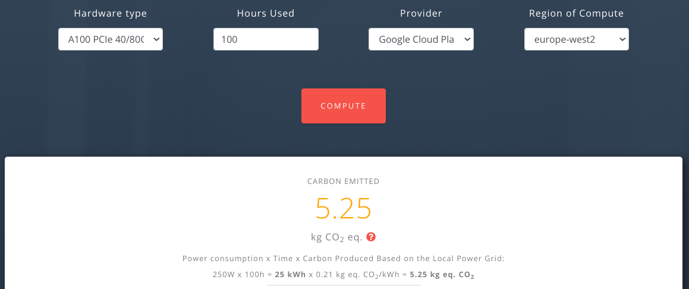
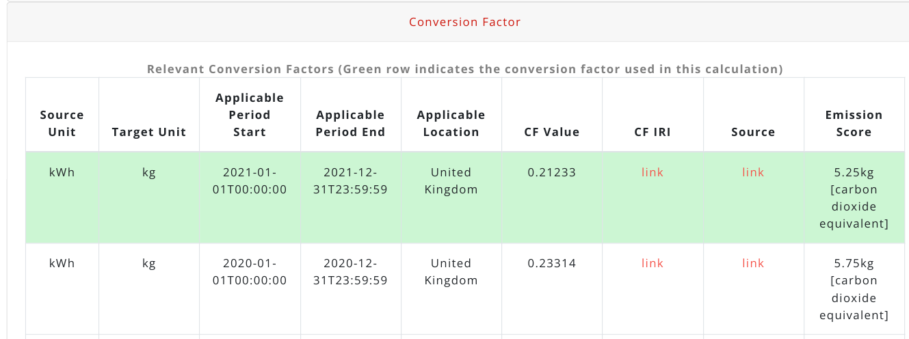

# Semantic Machine Learning Impact Calculator (SMLIC)
[](https://zenodo.org/badge/latestdoi/610785307)

This repository includes the code and queries used to create atransparent emission calculator, together with a fully transparent emission report.

**Demo:** https://calculator.linkeddata.es/

</img>

The report includes information on the provenance information for the conversion factots and their applicability (temporal and spatial) as shown in the following picture:

</img>

## Acknowledgemets 

The UI of this calculator has been derived from the code published by the <a href="https://github.com/mlco2/impact">Machine Learning's CO2 Impact</a>(MLIC) project. 

### Why is SMLIC different from MLIC?
SMLIC expands the MLIC by providing provenance information about the conversion factors shown in the UI by using the [CF knowledge graph](https://github.com/EATS-UoA/cfkg). It also represents in a machine-readable manner all the operations and calculations needed to produce an emission score, aligned with the [PECO ontology](https://w3id.org/peco).

## Supported Browser

We have tested the Semantic Calculator in Google Chrome

## JAVA Version

Minimum JAVA 11 is required to run this project. 

## External Dependencies

The following online resources must be available for the app to work: 

- https://sparql.cf.linkeddata.es/cf (Apache Jena Fuseki)


## Config

Application is set to run on port 3000 by default. To change the default port edit the port entry in  application.yml 

````
server:
  port : 3000
````

## How to Run

````
git clone  https://github.com/TEC-Toolkit/Semantic_Machine_Learning_Impact_Calculator.git
````

then cd into the project directory and run 

````
mvn spring-boot:run
````

Go to localhost:3000 and you should see the landing page of the Calculator
